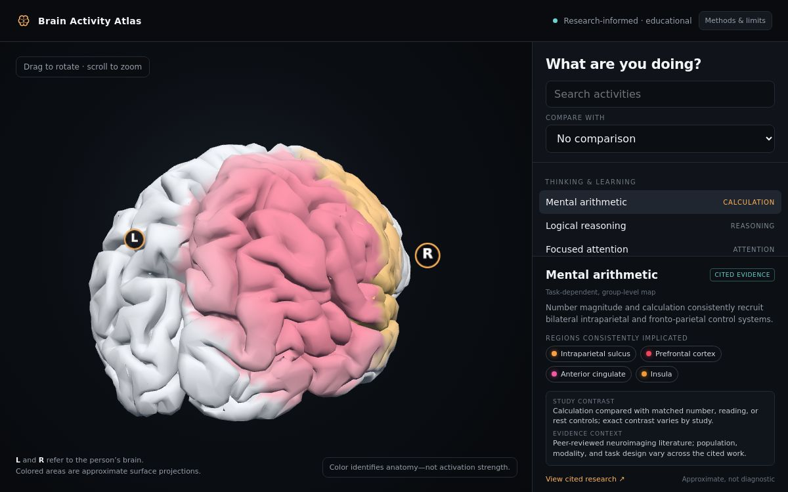

# Brain Activity Atlas

[](https://pardistaghavi.github.io/brain-activity-atlas/)
[](LICENSE)

An interactive 3D atlas showing brain regions consistently implicated in cognition, language, movement, sensation, emotion, and pain research.

[Open the live atlas](https://pardistaghavi.github.io/brain-activity-atlas/)



## Why this project exists

Brain diagrams often imply that one activity belongs to one isolated location. Neuroimaging research instead describes distributed, task-dependent networks. This atlas makes those networks explorable while keeping the important scientific limitations visible.

## Features

- Movable and zoomable 3D brain
- 25 activities across cognition, language, movement, sensation, emotion, and pain
- Color applied directly to the implicated brain regions
- Anatomical left/right markers that remain attached while the model rotates
- Activity-to-activity comparison showing shared and distinct regions
- Experimental contrast and evidence context for every activity
- Direct links to cited research
- Explicit explanation of BOLD, group-level evidence, and individual variability

## Scientific interpretation

The colors identify anatomical regions, not activation magnitude. Each map is a qualitative, group-level summary of the cited neuroimaging literature. “Activation” means a difference between a task and its study-specific comparison condition.

The atlas is educational and is not a diagnostic tool, medical device, or individual brain scan. Deep structures are approximate surface projections on the external model.

Methodological background:

- [Coordinate-based meta-analysis](https://pubmed.ncbi.nlm.nih.gov/21963913/)
- [Interpreting the fMRI BOLD signal](https://pmc.ncbi.nlm.nih.gov/articles/PMC5003850/)
- [Individual variability and precision mapping](https://pubmed.ncbi.nlm.nih.gov/39085426/)

Each activity contains a link to its primary cited source inside the application.

## Run locally

No build step or package installation is required.

```bash
git clone https://github.com/PardisTaghavi/brain-activity-atlas.git
cd brain-activity-atlas
python3 -m http.server 8000 --directory dist
```

Open <http://localhost:8000>.

## Project structure

```text
dist/
  index.html          Application, interface, data, and rendering logic
  assets/
    brain.glb         3D brain mesh
    three.min.js      Three.js runtime
    GLTFLoader.*      glTF model loading
    OrbitControls.*   Camera controls
    draco_*           Draco mesh decoder
docs/
  brain-activity-atlas.png
```

## Contributing

Contributions are welcome, particularly:

- corrections supported by systematic reviews or meta-analyses;
- additional tasks with an explicit experimental contrast;
- accessibility and mobile improvements;
- better open anatomical meshes and atlas registration.

Read [CONTRIBUTING.md](CONTRIBUTING.md) before opening a pull request.

## Citation

If you use the software in teaching or research, cite it using [CITATION.cff](CITATION.cff).

## License

Original source code and documentation are licensed under the [MIT License](LICENSE).

Bundled third-party libraries and the 3D mesh are handled separately; see [THIRD_PARTY_NOTICES.md](THIRD_PARTY_NOTICES.md). The current brain mesh does not contain embedded provenance or license metadata and is therefore excluded from the MIT grant until its provenance is verified.
